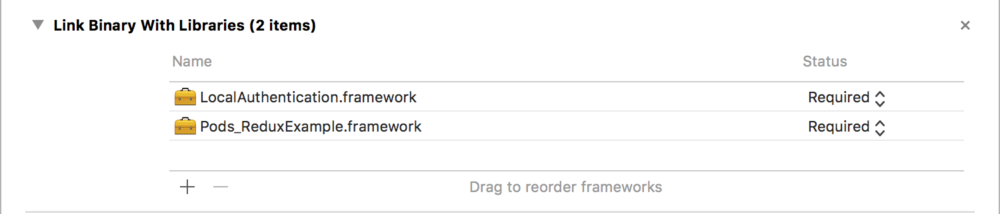
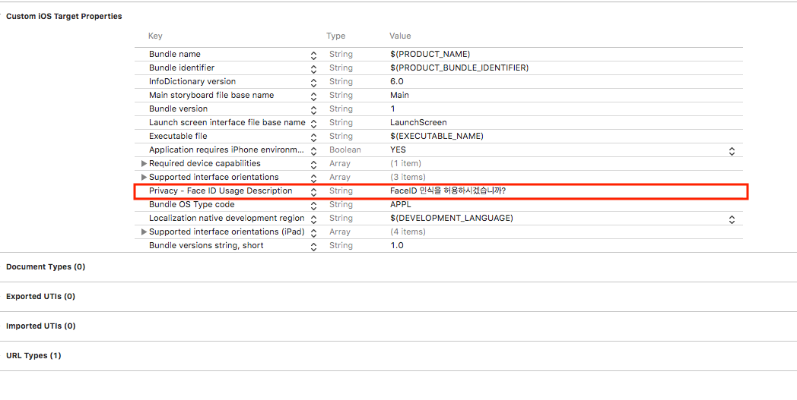
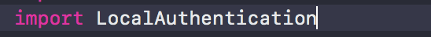

프레임워크 추가



Info.plist에 권한추가



import



```swift
    func showFirstButton() {

        let myContext = LAContext()
        let myLocalizedReasonString = "테스트할꺼니깐 인증을 해랏!"
        
        var authError: NSError?
        if #available(iOS 8.0, *) {
            if myContext.canEvaluatePolicy(.deviceOwnerAuthenticationWithBiometrics, error: &authError) {
                myContext.evaluatePolicy(.deviceOwnerAuthenticationWithBiometrics, localizedReason: myLocalizedReasonString, reply: { (success, error) in
                    if success {
                        // 생체id 인증을 성공했을 시
                        print("인증성공")
                    } else {
                        // 생체id 인증을 실패할 시
                        print("인증실패")
                    }
                })
            } else {
                // 생체id 인증을 허용하지 않을 시 생체id 인증을 설정에 가서 바꾸는걸 권장하는 안내 팝업을 띄운다.
                print("없어")
            }
        } else {
            print("버전 낮으면 꺼졍!")
        }
    }

```